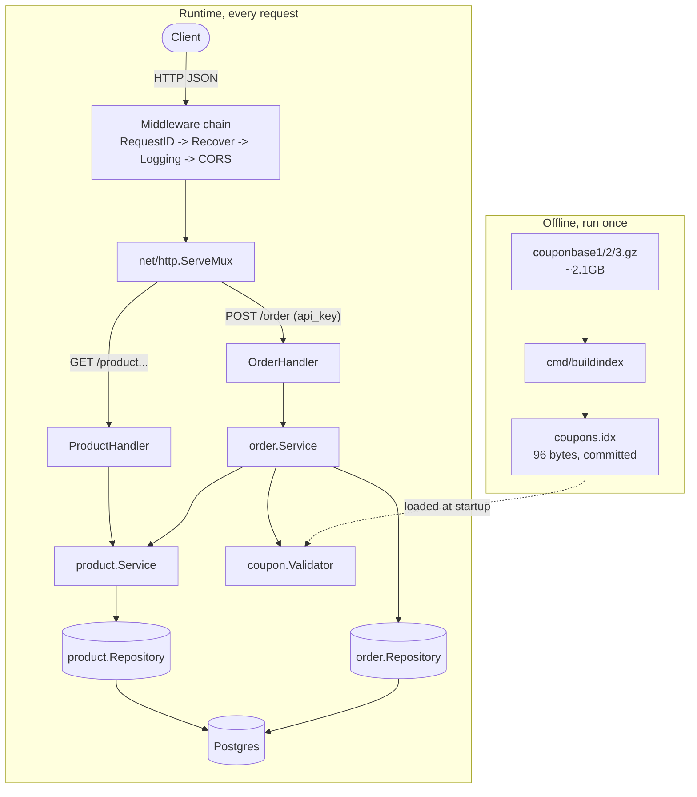

# Oolio Kart Challenge: Food Ordering API

Go implementation of Oolio's food-ordering OpenAPI 3.1 spec, for the advanced backend challenge.

- Stdlib `net/http` for routing
- Postgres for storage otherwise fallback to in-memory for DB connection failure (assessment purpose)
- Scale-conscious design for promo-code validation.

## Table of Contents

1. [Features](#features)
2. [Quickstart](#quickstart)
3. [Architecture](#architecture)
4. [Coupon Validation](#coupon-validation)
5. [API Reference](#api-reference)
6. [Design Decisions](#design-decisions)
7. [Scalability](#scalability)
8. [Testing](#testing)
9. [Status](#status)

---

## Features

- **Product catalog** — list all products, fetch one by id
- **Order placement** — prices computed server-side, client-supplied prices never trusted
- **Duplicate-item merging** — the same `productId` sent twice in one order merges into a single line item
- **5% coupon discount** — flat rate on a valid code, a documented extension beyond the base spec
- **Coupon validation at real scale** — checked against ~313M real candidate codes via an offline-built binary index, O(log n) lookup
- **Product images** — thumbnail/mobile/tablet/desktop URLs, matching the base spec
- **API-key authentication** — constant-time comparison on `POST /order`, timing-attack safe
- **CORS support** — the separate React frontend calls this API cross-origin
- **Structured logging** — JSON logs correlated by request id
- **Health checks** — `/healthz` liveness, `/readyz` readiness against Postgres
- **Postgres persistence** — versioned SQL migrations, connection pooling
- **Full test coverage** — unit, integration (real Postgres), and OpenAPI contract tests
- **Dockerized** — multi-stage build to a distroless runtime image, one-command `docker compose up`
- **CI on every push** — gofmt, vet, golangci-lint, build, test
- **Postman collection** — runnable requests and assertions for every endpoint and error path
- **React frontend** — catalog, cart, coupon checkout, order confirmation, in a [separate repo](https://github.com/Vasanth-Korada/oolio-kart-challenge-web)

---

## Quickstart

```bash
make docker-up   # postgres + backend, using the already-built coupons/coupons.idx
```

Server listens on `:8080`.

- `POST /order` needs an `api_key: apitest` header (configurable via `API_KEY`)
- `coupons/coupons.idx` is committed (96 bytes): that's all you need to run it
- `make fetch-coupons` / `make build-coupon-index` rebuild that index from the original ~2.1GB source files (not committed, see [Coupon Validation](#coupon-validation))
- No Postgres handy? `go run ./cmd/server` still works: it falls back to an in-memory store with a logged warning if Postgres is unreachable. This is for reviewer convenience only, a real deployment should fail fast instead of silently dropping to non-persistent storage; see the comment in `cmd/server/main.go`

Want the UI too? See [oolio-kart-challenge-web](https://github.com/Vasanth-Korada/oolio-kart-challenge-web). Point it at this server with `VITE_API_BASE_URL=http://localhost:8080`.

**Postman:** import `postman/oolio-kart-challenge.postman_collection.json` and `postman/local.postman_environment.json`, covers every endpoint plus the 401/403/422/404/400 error paths, each request has an assertion. `make postman-test` runs it headless via [newman](https://github.com/postmanlabs/newman).

---

## Architecture

Layered, interface-first: handlers depend on `Service` interfaces, services depend on `Repository`/`Validator` interfaces, never on concrete storage.



Two halves: an offline, one-time build turning ~2.1GB of raw data into a 96-byte artifact, and a runtime path that only ever touches the small loaded index.

```
cmd/server        - wiring: config, DB pool, migrations, coupon index, routes, graceful shutdown
cmd/buildindex     - offline tool: raw coupon files -> coupons.idx
internal/httpapi   - stdlib net/http handlers, middleware, error envelope
internal/product   - model, Service, Repository (Postgres + in-memory)
internal/order     - model, Service (validation, pricing, coupon check), Repository
internal/coupon    - Validator + Index (lookup), Source (gzip input), build pipeline, index file format
internal/platform  - postgres pool/migrations, structured logging, id generation
migrations/        - SQL schema + product seed data
```

`product` and `order` are organized by feature, not by layer, each owns its full vertical slice. See [Design Decisions](#design-decisions).

---

## Coupon Validation

The centerpiece of this assignment.

**Rule:** valid only if 8-10 characters long, and it appears in at least 2 of the 3 supplied files (`couponbase1/2/3.gz`).

**Real numbers**, measured against the actual files:

| File | Compressed | Lines | Unique candidates (len 8-10) |
| --- | --- | --- | --- |
| couponbase1.gz | 655MB | 107,260,777 | 107,258,700 |
| couponbase2.gz | 729MB | 107,260,776 | 107,260,726 |
| couponbase3.gz | 738MB | 98,566,152 | 98,566,151 |
| **Total** | **~2.1GB** | **313,087,705** | |

- **8 valid codes** survive the rule, written to a **96-byte** index
- The 3 files are read and sorted concurrently (`errgroup`), independent until the merge step, one-time cost regardless

**Why this design:**

- **Build once, not every boot.** Reprocessing all three files on every boot re-pays ~2.1GB of decompression for data that never changes. `cmd/buildindex` runs once; the server just loads the small result.
- **Sorted slices, not one shared map.** A single `map[key]bitmask` was the first design. At ~313M lines its overhead costs tens of GB of RAM. Each file's candidates are sorted and deduplicated into an 11-byte/entry slice instead, then k-way merged. Peak memory is the sum of each file's own unique count, not a map multiplier.
- **Raw codes, not hashes.** Valid codes are at most 10 bytes, so each is stored as-is in a fixed 11-byte key (length byte + zero-padded code). That gives exact matching with no collision risk, and is smaller than a 128-bit hash would be.
- **Resumable downloads.** These files are large enough to stall mid-transfer (it happened during development). The fetch step checks size against `Content-Length` and resumes, rather than trusting a tool's exit code.
- **Graceful on a bad file.** A truncated or corrupted source file logs a warning and the build continues with what it read, instead of aborting.

Verified against real data: `HAPPYHRS` and `FIFTYOFF` are valid, `SUPER100` is not (`internal/coupon/index_real_data_test.go`).

**Alternatives rejected:**
- **Reprocess on every boot.** ~2.1GB of near-random, barely-compressible data. Wasted work for data that never changes.
- **A Postgres `coupon_codes` table.** Would work, but adds a network round trip per order for data that's cheaper to hold as an in-process sorted slice.

---

## API Reference

### `GET /product`

List all products. No authentication required.

**Response `200`:**

```json
[
  { "id": "1", "name": "Waffle with Berries", "price": 6.5, "category": "Waffle" }
]
```

### `GET /product/{id}`

| Status | Condition |
| --- | --- |
| 200 | Product found |
| 400 | `id` is not an integer |
| 404 | Product does not exist |

### `POST /order` 🔒

Requires an `api_key` header.

**Request:**

```json
{
  "items": [
    { "productId": "1", "quantity": 1 },
    { "productId": "9", "quantity": 1 }
  ],
  "couponCode": "HAPPYHRS"
}
```

**Response `200`** (a real captured response):

```json
{
  "id": "7117484d-c0c2-4d84-84e1-f0a079bfbd1e",
  "items": [
    { "productId": "1", "quantity": 1 },
    { "productId": "9", "quantity": 1 }
  ],
  "products": [
    { "id": "1", "name": "Waffle with Berries", "price": 6.5, "category": "Waffle" },
    { "id": "9", "name": "Oat & Raisin Cookie", "price": 3.5, "category": "Cookie" }
  ],
  "couponCode": "HAPPYHRS",
  "subtotal": 10,
  "discount": 0.5,
  "total": 9.5
}
```

| Status | Condition |
| --- | --- |
| 200 | Order placed |
| 400 | Malformed JSON body |
| 401 | Missing `api_key` header |
| 403 | Wrong `api_key` |
| 422 | Empty items, bad quantity, unknown product, or invalid coupon |

The base `Order` schema has no pricing fields.

- `couponCode`, `subtotal`, `discount`, `total` are a documented extension
- `subtotal` is server-computed from real prices, never the client's
- A valid coupon is a flat 5% off (`internal/order.CouponDiscountRate`), since no rate is specified anywhere
- `additionalProperties` isn't restricted in the base spec, so this doesn't break conformance
- `api/openapi.yaml` documents them explicitly

### Operational endpoints

Not part of the OpenAPI spec, standard production hygiene:

| Endpoint | Purpose |
| --- | --- |
| `GET /healthz` | Liveness: always `200` once serving |
| `GET /readyz` | Readiness: `503` if a connected Postgres becomes unreachable; body also reports `"storage": "postgres"` or `"in-memory (fallback)"` so a caller can tell which mode is actually live |

---

## Design Decisions

- **Stdlib-first, one exception.** No HTTP framework, no ORM. Go 1.22+'s `net/http.ServeMux` handles method and path-param routing natively. `pgx` (no built-in Postgres driver) is the one deliberate dependency for storage.
- **UUID v4 order IDs**, not sequential integers. Sequential ids let anyone enumerate `/order/4`, `/order/5`, ... (an IDOR risk). `crypto/rand` makes guessing infeasible.
- **Package-by-feature, not package-by-layer.** `internal/product` and `internal/order` each own their full vertical slice, instead of a shared `handler/`/`service/`/`repository/` split. Keeps a feature's blast radius to one package, avoids Go's import-cycle friction between layers.
- **Sentinel errors, `errors.Is`, never string-matched.** Package-level `errors.New` values, mapped to status codes by identity. Safe across wrapping and refactors.
- **Compose credentials are overridable, not hardcoded-only.** `docker-compose.yml` uses `${VAR:-oolio}` syntax with a `deploy/.env.example` companion, so the plaintext local-dev defaults visible in the file are just defaults, not the only option. A real deployment would inject credentials from a secrets manager at deploy time, out of scope for a local dev compose file, but the override path exists rather than being hardcoded-only.

---

## Scalability

| Component | Now | To scale further |
| --- | --- | --- |
| Coupon validation | 96-byte index, O(log n) binary search | Shard the offline build by byte range; gzip's multistream boundaries are natural split points |
| Products | Postgres, ~10 rows | Cache (Redis) in front of `product.Repository`; interface doesn't change |
| Orders | Postgres, one transaction per order | Read replicas for reporting |
| API server | Single stateless process | Horizontal |
| Coupon index build | Per-file concurrent (`errgroup`), single process | Shard within each file by byte range (gzip multistream boundaries), or distribute across machines for many more source files |

---

## Testing

One test file per layer, table-driven with `t.Run` sub-tests (the coupon package uses `testify/suite`):

| Layer | Where | Covers |
| --- | --- | --- |
| Repository | `*_repository_test.go` | In-memory directly; `*_integration_test.go` (tag `integration`) against a live Postgres |
| Service | `service_test.go` | Validation, pricing, coupon checks, persistence, with fakes |
| Handler | `*_handler_test.go` | Status codes and error mapping, with a fake service |
| Contract | `contract_test.go` | Every request/response validated against `api/openapi.yaml` via [kin-openapi](https://github.com/getkin/kin-openapi) |
| Coupon | `internal/coupon/*_test.go` | Length boundaries, the build against in-memory `Source` fakes (overlap, repeats, partial and failing sources), gzip input incl. truncated files, index file validation, the real files' documented examples |

```bash
make test              # everything except Postgres integration tests
make integration-test  # Postgres repos, needs DATABASE_URL
make lint               # golangci-lint
make vet / make fmt     # go vet / gofmt check
```

CI runs on every push: gofmt, vet, [golangci-lint](https://golangci-lint.run/) (curated for real bug/security signal, not a maximal dump), build, `make test`.

---